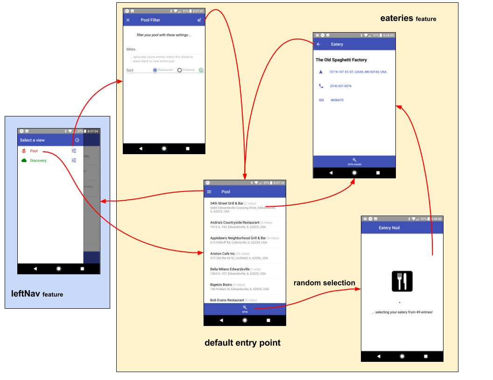

# eatery-nod

A mobile app to randomly select a restaurant for "date night".  My
wife and I have a steady "date night" (Fri night), and we are always
indecisive on which of our favorite restaurants to frequent :-)

eatery-nod is my first
[react-native](https://facebook.github.io/react-native/) mobile app,
using [Expo](https://expo.io/).

## Overview

### Eatery Pool

The main screen of eatery-nod is the [Eatery Pool](src/feature/eateries).  

This visualizes your persistent pool of restaurants to select from
(the list can optionally be filtered).

You can select a restaurant directly, or "spin" for a random
selection.

The "detailed" view provides direct communication to the establishment
(phone them, visit their web site, or navigate to their address).

