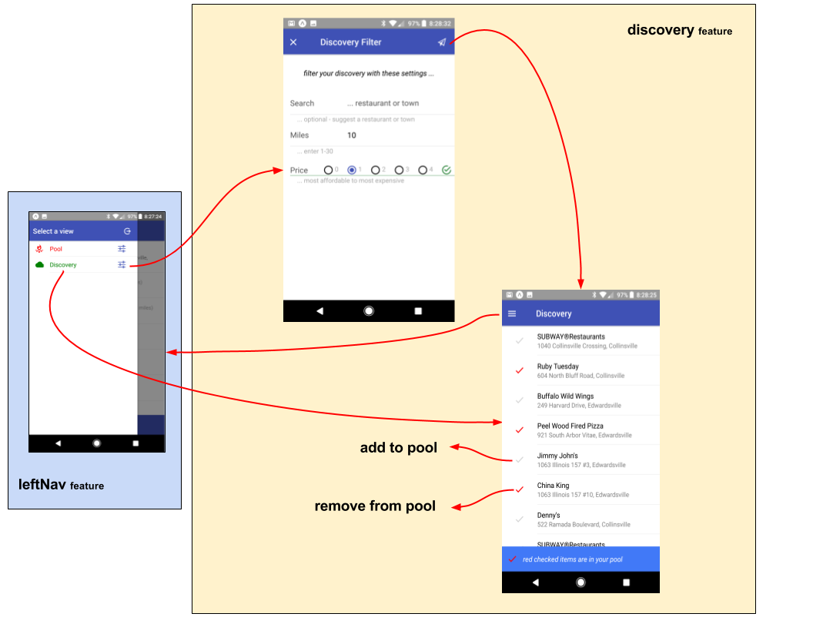

# eatery-nod

A mobile app to randomly select a restaurant for "date night".  My
wife and I have a steady "date night" (Fri night), and we are always
indecisive on which of our favorite restaurants to frequent :-)

eatery-nod is my first
[react-native](https://facebook.github.io/react-native/) mobile app,
using [Expo](https://expo.io/).

## Overview

### Eatery Pool

The main screen of eatery-nod is the **Eatery Pool** (_please refer to
the [eateries feature](src/feature/views/eateries)_).

This visualizes your persistent pool of restaurants to select from
(the list can optionally be filtered).

You can select a restaurant directly, or "spin" for a random
selection.

The "detailed" view provides direct communication to the establishment
(phone them, visit their web site, or navigate to their address).

### Discovery

Your pool of eateries is maintained through **Discovery** (_please
refer to the [discovery feature](src/feature/views/discovery)_).

You don't have to maintain the details of your pool by hand.  Rather,
you simply search the restaurants using the **disovery** feature.
This is the same source that is used when you issue a Google Search
(based on [Google Places](https://developers.google.com/places/)).

Within the discovery view, you simply toggle the check next to the
entry.  **Red** entries are in your pool, **Grey** entries are not.

### Authorization

Authorization is provided through the [auth
feature](src/feature/init/auth), requiring a validated email/password
before promoting any application screens.

