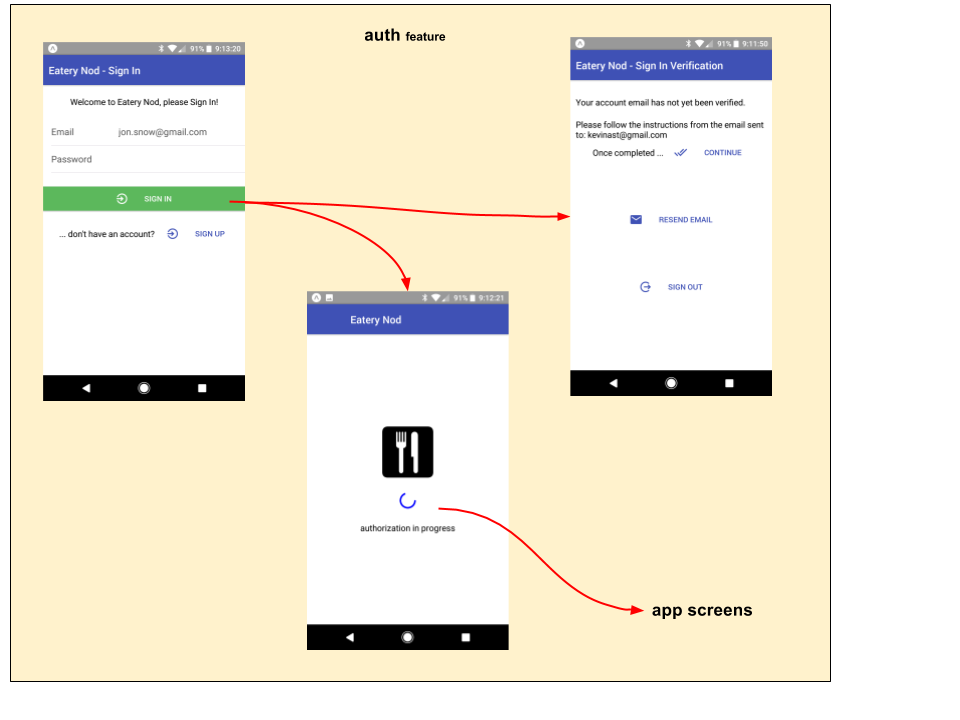

# auth feature

The **'auth'** feature promotes complete user authentication.
It accomplishes the following:

 - starts authorization process by monitoring device ready action
   (`fassets.device.actions.ready`) **(logic)**

   - interacts with authentication services **(logic, reducer)** ?? what reducer does this?

   - gathers user credentials from various authentication screens
     **(route, logic)**

   - manages "Auto SignIn" through retained device credentials
     **(logic)**

   - fetches user profile as part of the SignIn process **(logic,
     reducer)**

 - disables app-specific visuals until the user is fully authenticated,
   by promoting various authentication screens until authentication
   is complete **(route)**

 - emits key action that triggers downstream eateries to bootstrap **(logic)**:
   ```
   fassets.auth.actions.userProfileChanged(user)
   ```

## State Transition

For a high-level overview of how actions, logic, and reducers interact
together to maintain this feature's state, please refer to the [State
Transition](docs/StateTransition.txt) diagram.

## Screen Flow


