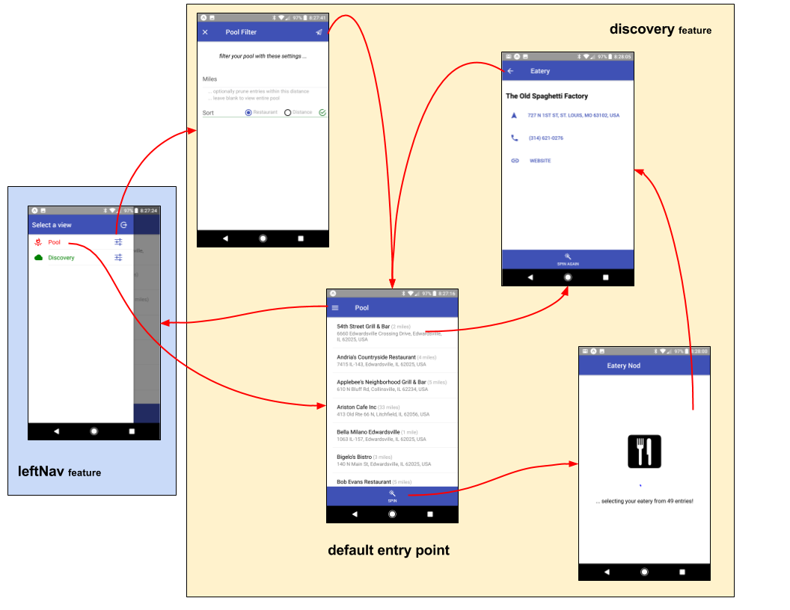

# discovery feature

The **'discovery'** feature manages and promotes the discovery view
... a list of eateries "discovered" from GooglePlaces.  Eateries
can be added/removed from our pool by simply checking/unchecking
the entries.

## State Transition

For a high-level overview of how actions, logic, and reducers interact
together to maintain this feature's state, please refer to the [State
Transition](docs/StateTransition.txt) diagram.

## Screen Flow

