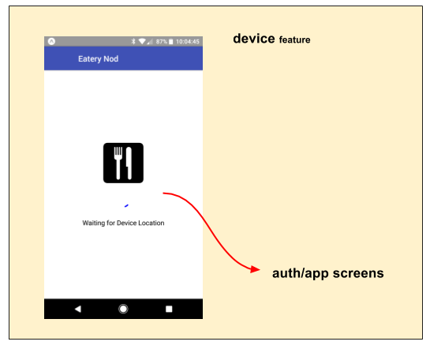

# device feature

The **device** feature initializes the device for use by the app.

In general, this initialization is "critical path items", because they are
required before the app can actually run.

It accomplishes the following:

 - ?? SYNC from feature.js

## State Transition

For a high-level overview of how actions, logic, and reducers interact
together to maintain this feature's state, please refer to the [State
Transition](docs/StateTransition.txt) diagram.

## Screen Flow

