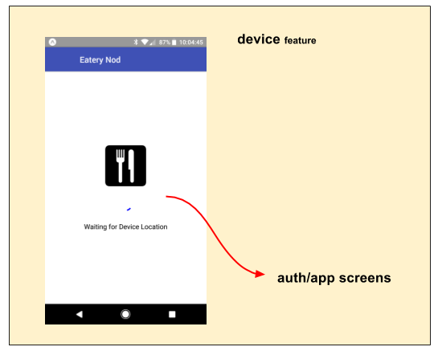

# device feature

The **device** feature initializes the device for use by the app.

In general, this initialization represents critical-path items that
must be completed before the app can run.

It accomplishes the following:

 - initiates the kickStart initialization process, by dispatching
   the device `kickStart()` action **(appDidStart)**.

   - This process operates under the `'kickStart.*'` fassets use
     contract **(fassets.use, logic)**, and drives the following
     initialization:
     
     - `'kickStart.fonts'` ... loads the fonts required by the native-base GUI lib
     
     - `'kickStart.location'` ... initializes the device GPS location
     
   - The `setStatus(statusMsg)` action is emitted to reflect the
     overall kickStart status (e.g. 'Waiting for bla bla bla' -or-
     'READY').  This status can optionally be used (say by a
     SplashScreen) as user communication of what is going on.
     
   - The `ready()` action is emitted when all kickStart
     initialization has completed, and the app is fully initialized
     and ready to run.  This action is typically monitored by an
     external feature to start the app.

 - performs device-specific initialization (iOS/Android) through
   the platformSetup() function **(appWillStart)**

 - injects the notify utility in the root DOM **(appWillStart)**

 - disables downstream visuals until the device is ready -
   displaying a SplashScreen **(route)**

## State Transition

For a high-level overview of how actions, logic, and reducers interact
together to maintain this feature's state, please refer to the [State
Transition](docs/StateTransition.txt) diagram.

## Screen Flow

